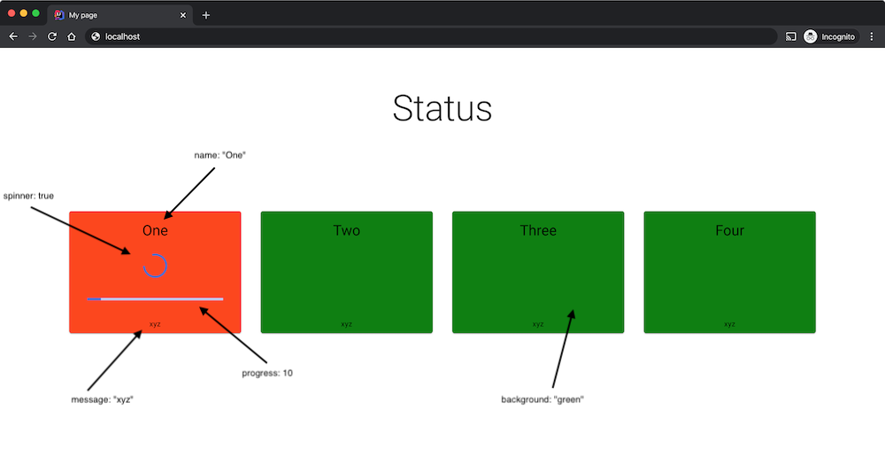

# Status Dashboard

This is a very simple react app which can be used to display the state (eg success, fail, in progress) of one or more things.

It is implemented as a single HTML page so its easy to drop into an existing application - simply implement an http endpoint that returns the required data payload (see [test-data.json]).

![screenshot1.png]

The data payload is structured as shown below:

```
{
    "error": null,
    "title": "Status",
    "cards": [
        {
            "id": 1,
            "name": "One",
            "spinner": true,
            "progress": 10,
            "mode": "pulsing",
            "color": "orange",
            "message": "xyz"
        },
        {
            "id": 2,
            "name": "Two",
            "spinner": false,
            "color": "green",
            "message": "xyz"
        }
    ]
}
```

Main body:

* error - Error message which will be rendered if present
* title - Main title
* cards - An array of cards to show

Each card should contain:

* id - Unique id
* name - Shown at top of card
* spinner - Boolean to show spinner
* progress - Integer from 0 to 100 - if present a progress bar will be shown
* mode - Css classname to include on the card. Current values are
  * pulsing - to show a pulsing animation
* color - Background color of card
* message - A message to show at the bottom of the card (could be a timestamp or other indicator of data age)



# What can it be used for?

Lets say you have an application and you want to put a TV screen on the wall, showing it's status. After adding the data endpoint and dropping the HTML file in, you can easily configure the browser on your tv to show this page.
